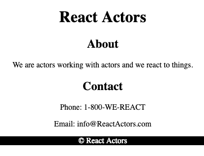

# React Actors

Create an application for the React Actors - a troop of impersonators and improvisors.

Do not fork and clone this repo. These are just instructions. Instead, use `create-react-app` to create a new react application on your computer.

## Requirements

Your react application should have five components.

- App.js
- Header.js
- About.js
- Contact.js
- Footer.js



### App.js

The code for `App.js` is included below. No changes should be necessary to this code for the requirements or stretch goals.

```JSX
import React, { Component } from 'react';
import './App.css';
import Header from '../Header/Header';
import About from '../About/About';
import Contact from '../Contact/Contact';
import Footer from '../Footer/Footer';

class App extends Component {
  render() {
    return (
      <div className="App">
        <Header />
        <About />
        <Contact />
        <Footer />
      </div>
    );
  }
}

export default App;

```

### Header.js

Should contain an `h1` that says `React Actors`

### About.js

Should contain an `h2` that says `About` and a paragraph describing the organization.

### Contact.js

Should contain an `h2` that says `Contact`, a paragraph with the phone number, and a paragraph with the email.

### Footer.js

Should contain a copyright © React Actors (don't worry about the symbol if you can't get it working, but you should be able to copy and paste it).

## Stretch Goals

We need to let new people join the react actors. Watch this clip to see what we would like from the form. (This form will not actually add anything to a list, it's a proof of concept that simply alerts the result.)

- A sentence should appear below the form that says who the person is and their best impression.
- This sentence should display only if all three fields have values. (Research conditional rendering.)
- An alert should say thank you and then the first name
- The form should clear after click


Here is a deployed version with stretch goals: https://react-actors.netlify.com/
